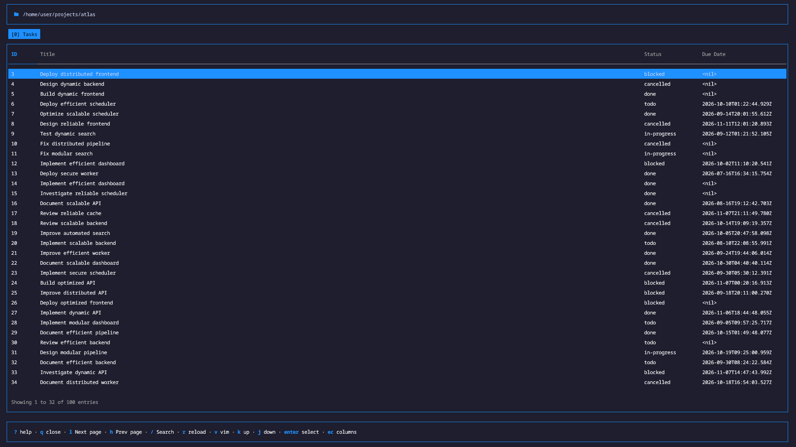
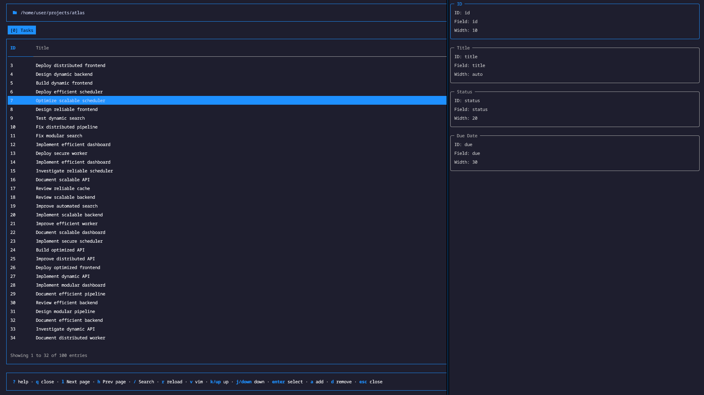
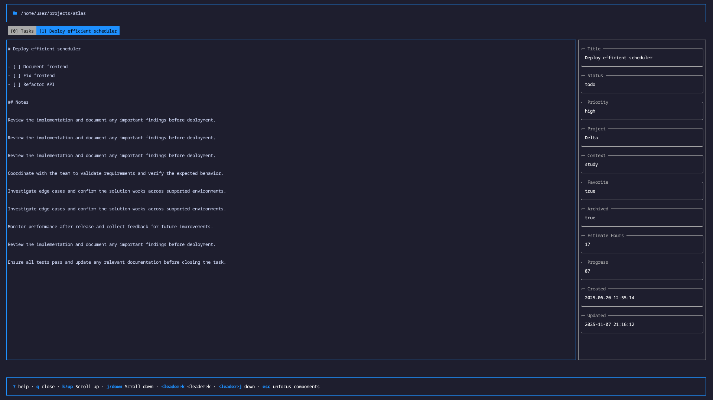

# Atlas (alpha phase)

A command line and terminal user interface (TUI) tool to manage files, folders and custom metadata.



## Entry and Metas

Atlas is based on `entries` that are simple files or folders.

And `metas` that are "data" related to a entry.

Metas can be any data that can be associated to an entry like file stats(type, ext, size) or more data related to the entry contens like a `frontmatter` of a markdwon file or a json file properties for example

```
tasks/010_implement_efficient_dashboard.md

id: task-010
due: 2026-10-02T11:10:20.541Z
ext: md
path: tasks/010_implement_efficient_dashboard.md
type: file
title: Implement efficient dashboard
parent: tasks
source: generated
status: blocked
...
```

## Metadata handlers

These are services to handle get, set, unset metas from the entries the workspace.

For example the `frontmmater` extract all fields in the contents of a markdown file and convert they in metas for the entry, and when the app ask for an update it update the frontmatter in the file contents

Current we have 3 buit-in handlers and each handler has its won options

- `json`: get file properties as metas
- `frontmatter`: get file frontmatter as properties
- `content`: get file contens as text
- `stat`: get filesystem properties (type, ext, basename, parent)

To use they you just need to configure in the `config.yml` file

```yml
handlers:
    - type: content
      patterns: ["**/*.md", "**/*.json"]
      transformers:
          - type: remove
            from: "---"
            to: "---\n"

          - type: trim

    - type: stat
      patterns: ["**/*.md", "**/*.json"]

    - type: frontmatter
      patterns: ["**/*.md"]
      prefix: ""

    - type: json
      patterns: ["**/*.json"]
```

Examples:

- [tasks/.atlas/config.yml](./examples/tasks/.atlas/config.yml)
- [config-folder/.atlas/config/handlers/content.yml](./examples/config-folder/.atlas/config/handlers/content.yml)
- [config-folder/.atlas/config/handlers/fm.yml](./examples/config-folder/.atlas/config/handlers/fm.yml)
- [config-folder/.atlas/config/handlers/stat.yml](./examples/config-folder/.atlas/config/handlers/stat.yml)

### Custom metadata handler

You can also make your own metadata handler using the `shell` type.

This handle executes a file and use the output to create the metas.

You can technically any language but keep in mind that if the execution speed will affect the sync speed too.

```yml
handlers:
    - type: shell
      bin: "{{ .workspace.atlas_path }}/handlers/task_id.sh"
      patterns: ["**/*.md"]
```

```bash
#!/bin/sh

input=$(cat)

basename=$(printf '%s' "$input" | jq -r '.entry_info.basename')

id=${basename%%_*}

if [ "$basename" = "$id" ]; then
    slug=""
else
    slug=${basename#*_}
fi

jq -n \
    --arg id "$id" \
    --arg slug "$slug" \
    '{
        metas: {
            task_id: $id,
            slug: $slug
        }
    }'
```

Examples:
- [tasks/.atlas/config.yml](./examples/tasks/.atlas/config.yml)
- [.atlas/handlers/task_id.sh](./examples/tasks/.atlas/handlers/task_id.sh)

## Entries table

Entry table is a list of entries in the workspace, it have columns that can be customized to display the metas of an entry as a column




You can customize the columns in the tui but it is more easy to add a new screen that extend the entry_table with the columns you want in the config file:

```yml
screens:
    - id: task_table
      type: entry_table
      title: "Tasks"
      columns:
          - id: id
            label: "ID"
            field: task_id
            width: 10

          - id: title
            label: "Title"
            field: title
```

Examples: 

- [tasks/.atlas/config.yml](./examples/tasks/.atlas/config.yml)
- [config-folder/.atlas/config/screens/tasks.yml](./examples/config-folder/.atlas/config/screens/tasks.yml)


## Custom screens



By default the tui a `entry_table` screen and `entry_single` screen

But you can add `custom` screens to the app by config file

> warning: it still a working in progress feature

```yml
type: custom
components:
    - type: text
      content: "{{ .entry.content }}"
      cols: 220
      rows: 37
```

Examples:

- [config-folder/.atlas/config/screens/task_detail.yml](./examples/config-folder/.atlas/config/screens/task_detail.yml)

## Sync 

For speed and query purposes the tool use a SQL database that is syncronized with the current workspace.

But it is a disposable database, the `source of true` will always be files and folders and the metadata handlers, the database is only a facilitator

To syncronize all entries you can run
```sh
atlas sync:all
```

Or sync only a individual entry

```sh
atlas sync tasks/001_word_domination.md
```

## Search entries 

You can query entries using a special syntax for the tool:

```sh
atlas list -q "parent=tasks id=001"
```

The syntax follows a `key=value` pattern where the `key` is the metadata name

## Actions

You can declare app actions that are scripts that can be used later with keybinds.

```yml
actions:
    - id: vi
      type: shell
      description: open vi in a tmux popup to edit the entry
      command: tmux popup -E -h 90% -w 90% -x C -y C "vi {{ .entry.path }}"

    - id: generate-tasks
      type: shell
      description: generate ramdom tasks
      command: "{{ .workspace.atlas_path }}/bin/tasks.js 100"
```
Examples:

- [tasks/.atlas/config.yml](./examples/tasks/.atlas/config.yml)
- [config-folder/.atlas/config/actions/vi.yml](./examples/config-folder/.atlas/config/actions/vi.yml)

## Keybinds

You can add custom keymaps similar to `vim` in the tool.

And also it is possible to filter the places when they will be active like screens, components or a specifict entry

```yml
keymaps:
    - keys: [g]
      action: generate-tasks
      description: Generate tasks
      groups: [global]

    - keys: [o]
      action: vi
      description: open
      groups: [ext=md, ext=json]
```

```
<C-s>        -> ctrl+s
<C-c>        -> ctrl+c
<A-x>        -> alt+x
<S-Tab>      -> shift+tab
<Esc>        -> esc
<CR>         -> enter
<Up>         -> up
<leader>ff   -> <leader>, f, f
gg           -> g, g
```

Examples:

- [tasks/.atlas/config.yml](./examples/tasks/.atlas/config.yml)
- [config-folder/.atlas/config.yml](./examples/config-folder/.atlas/config.yml)
